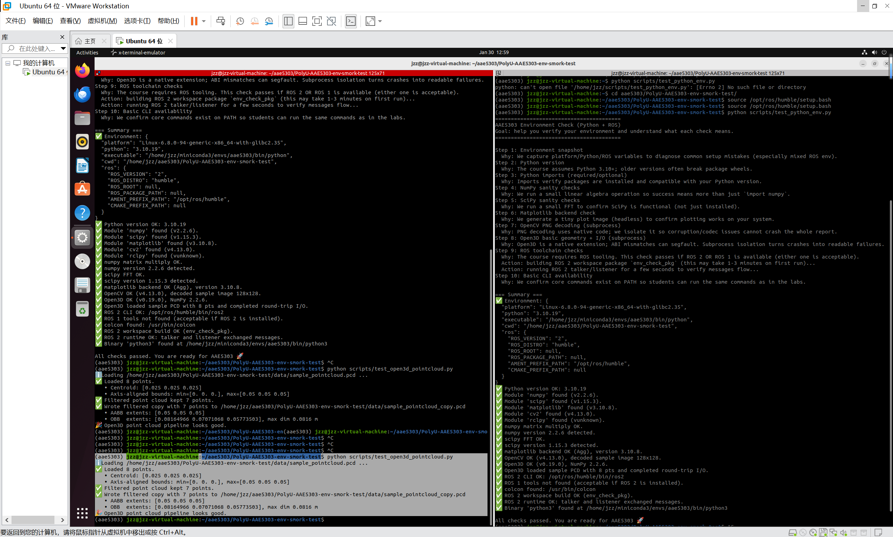
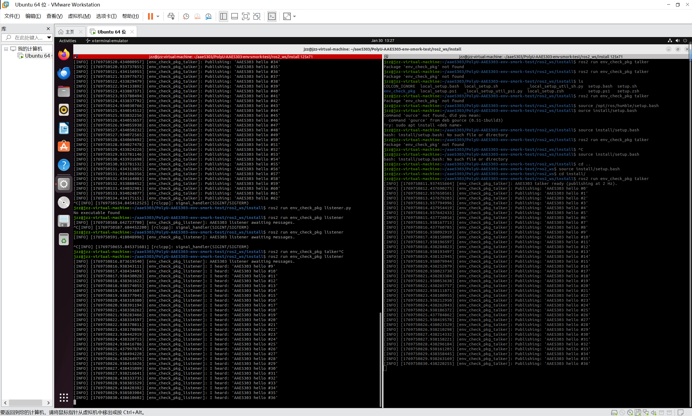

# AAE5303 Environment Setup Report — Template for Students

> **Important:** Follow this structure exactly in your submission README.  
> Your goal is to demonstrate **evidence, process, problem-solving, and reflection** — not only screenshots.

---

## 1. System Information

**Laptop model:**  
_[Lenovo Legion R9000P2021H]_

**CPU / RAM:**  
_[AMD Ryzen 7 5800H with Radeon Graphics]_

**Host OS:**  
_[Ubuntu 22.04]_

**Linux/ROS environment type:**  
_[Choose one:]_
- [ ] Dual-boot Ubuntu
- [ ] WSL2 Ubuntu
- [1] Ubuntu in VM (UTM/VirtualBox/VMware/Parallels)
- [ ] Docker container
- [ ] Lab PC
- [ ] Remote Linux server

---

## 2. Python Environment Check

### 2.1 Steps Taken

Describe briefly how you created/activated your Python environment:

**Tool used:**  
_[venv / conda / system Python]_

**Key commands you ran:**
```bash
python3 -m venv .venv
source .venv/bin/activate
pip install -r requirements.txt
```

**Any deviations from the default instructions:**  
_[Describe any changes you made, or write "None"]_

### 2.2 Test Results

Run these commands and paste the actual terminal output (not just screenshots):

```bash
python scripts/test_python_env.py
```

**Output:**
```
[(aae5303) jzz@jzz-virtual-machine:~/aae5303/PolyU-AAE5303-env-smork-test$ python scripts/test_python_env.py
========================================
AAE5303 Environment Check (Python + ROS)
Goal: help you verify your environment and understand what each check means.
========================================

Step 1: Environment snapshot
  Why: We capture platform/Python/ROS variables to diagnose common setup mistakes (especially mixed ROS env).
Step 2: Python version
  Why: The course assumes Python 3.10+; older versions often break package wheels.
Step 3: Python imports (required/optional)
  Why: Imports verify packages are installed and compatible with your Python version.
Step 4: NumPy sanity checks
  Why: We run a small linear algebra operation so success means more than just `import numpy`.
Step 5: SciPy sanity checks
  Why: We run a small FFT to confirm SciPy is functional (not just installed).
Step 6: Matplotlib backend check
  Why: We generate a tiny plot image (headless) to confirm plotting works on your system.
Step 7: OpenCV PNG decoding (subprocess)
  Why: PNG decoding uses native code; we isolate it so corruption/codec issues cannot crash the whole report.
Step 8: Open3D basic geometry + I/O (subprocess)
  Why: Open3D is a native extension; ABI mismatches can segfault. Subprocess isolation turns crashes into readable failures.
Step 9: ROS toolchain checks
  Why: The course requires ROS tooling. This check passes if ROS 2 OR ROS 1 is available (either one is acceptable).
  Action: building ROS 2 workspace package `env_check_pkg` (this may take 1-3 minutes on first run)...
  Action: running ROS 2 talker/listener for a few seconds to verify messages flow...
Step 10: Basic CLI availability
  Why: We confirm core commands exist on PATH so students can run the same commands as in the labs.

=== Summary ===
✅ Environment: {
  "platform": "Linux-6.8.0-94-generic-x86_64-with-glibc2.35",
  "python": "3.10.19",
  "executable": "/home/jzz/miniconda3/envs/aae5303/bin/python",
  "cwd": "/home/jzz/aae5303/PolyU-AAE5303-env-smork-test",
  "ros": {
    "ROS_VERSION": "2",
    "ROS_DISTRO": "humble",
    "ROS_ROOT": null,
    "ROS_PACKAGE_PATH": null,
    "AMENT_PREFIX_PATH": "/opt/ros/humble",
    "CMAKE_PREFIX_PATH": null
  }
}
✅ Python version OK: 3.10.19
✅ Module 'numpy' found (v2.2.6).
✅ Module 'scipy' found (v1.15.3).
✅ Module 'matplotlib' found (v3.10.8).
✅ Module 'cv2' found (v4.13.0).
✅ Module 'rclpy' found (vunknown).
✅ numpy matrix multiply OK.
✅ numpy version 2.2.6 detected.
✅ scipy FFT OK.
✅ scipy version 1.15.3 detected.
✅ matplotlib backend OK (Agg), version 3.10.8.
✅ OpenCV OK (v4.13.0), decoded sample image 128x128.
✅ Open3D OK (v0.19.0), NumPy 2.2.6.
✅ Open3D loaded sample PCD with 8 pts and completed round-trip I/O.
✅ ROS 2 CLI OK: /opt/ros/humble/bin/ros2
✅ ROS 1 tools not found (acceptable if ROS 2 is installed).
✅ colcon found: /usr/bin/colcon
✅ ROS 2 workspace build OK (env_check_pkg).
✅ ROS 2 runtime OK: talker and listener exchanged messages.
✅ Binary 'python3' found at /home/jzz/miniconda3/envs/aae5303/bin/python3

All checks passed. You are ready for AAE5303 🚀
]
```

```bash
python scripts/test_open3d_pointcloud.py
```

**Output:**
```
[
(aae5303) jzz@jzz-virtual-machine:~/aae5303/PolyU-AAE5303-env-smork-test$ python scripts/test_open3d_pointcloud.py
ℹ️ Loading /home/jzz/aae5303/PolyU-AAE5303-env-smork-test/data/sample_pointcloud.pcd ...
✅ Loaded 8 points.
   • Centroid: [0.025 0.025 0.025]
   • Axis-aligned bounds: min=[0. 0. 0.], max=[0.05 0.05 0.05]
✅ Filtered point cloud kept 7 points.
✅ Wrote filtered copy with 7 points to /home/jzz/aae5303/PolyU-AAE5303-env-smork-test/data/sample_pointcloud_copy.pcd
   • AABB extents: [0.05 0.05 0.05]
   • OBB  extents: [0.08164966 0.07071068 0.05773503], max dim 0.0816 m
🎉 Open3D point cloud pipeline looks good.
]
```

**Screenshot:**  
_[Include one screenshot showing both tests passing]_



---

## 3. ROS 2 Workspace Check

### 3.1 Build the workspace

Paste the build output summary (final lines only):

```bash
source /opt/ros/humble/setup.bash
colcon build
```

**Expected output:**
```
Summary: 1 package finished [x.xx s]
```

**Your actual output:**
```
[Summary: 1 package finished [9.91s]]
```

### 3.2 Run talker and listener

Show both source commands:

```bash
source /opt/ros/humble/setup.bash
source install/setup.bash
```

**Then run talker:**
```bash
ros2 run env_check_pkg talker.py
```

**Output (3–4 lines):**
```
[[INFO] [1769750502.933263835] [env_check_pkg_talker]: AAE5303 talker ready (publishing at 2 Hz).
[INFO] [1769750503.433743368] [env_check_pkg_talker]: Publishing: 'AAE5303 hello #0'
[INFO] [1769750503.933491036] [env_check_pkg_talker]: Publishing: 'AAE5303 hello #1'
[INFO] [1769750504.433847176] [env_check_pkg_talker]: Publishing: 'AAE5303 hello #2'
[INFO] [1769750504.933938132] [env_check_pkg_talker]: Publishing: 'AAE5303 hello #3'
[INFO] [1769750505.433905124] [env_check_pkg_talker]: Publishing: 'AAE5303 hello #4']
```

**Run listener:**
```bash
ros2 run env_check_pkg listener.py
```

**Output (3–4 lines):**
```
[[INFO] [1769750816.873619540] [env_check_pkg_listener]: AAE5303 listener awaiting messages.
[INFO] [1769750816.938343111] [env_check_pkg_listener]: I heard: 'AAE5303 hello #9'
[INFO] [1769750817.438434491] [env_check_pkg_listener]: I heard: 'AAE5303 hello #10'
[INFO] [1769750817.938430028] [env_check_pkg_listener]: I heard: 'AAE5303 hello #11'
[INFO] [1769750818.438361622] [env_check_pkg_listener]: I heard: 'AAE5303 hello #12']
```

**Alternative (using launch file):**
```bash
ros2 launch env_check_pkg env_check.launch.py
```

**Screenshot:**  
_[Include one screenshot showing talker + listener running]_



---

## 4. Problems Encountered and How I Solved Them

> **Note:** Write 2–3 issues, even if small. This section is crucial — it demonstrates understanding and problem-solving.

### Issue 1: [Failed <<< env_check_pkg [0.42s, exited with code 1]]

**Cause / diagnosis:**  
_[Missing catkin_pkg. And it uses the Python in my conda environment.]_

**Fix:**  
_[The exact command/config change you used to solve it]_

```bash
[
    conda install -c conda-forge catkin_pkg -y
    cd ~/aae5303/PolyU-AAE5303-env-smork-test/ros2_ws
    rm -rf build install log
    source /opt/ros/humble/setup.bash
    colcon build --event-handlers console_direct+ --executor sequential
]
```

**Reference:**  
_[ROS 2 Documentation and ChatGPT answer]_

---

### Issue 2: [ ✅ Python version OK: 3.10.19 ✅ Module 'numpy' found (v2.2.6). ✅ Module 'scipy' found (v1.15.3). ✅ Module 'matplotlib' found (v3.10.8). ✅ Module 'cv2' found (v4.13.0). ✅ Module 'rclpy' found (vunknown). ✅ numpy matrix multiply OK. ✅ numpy version 2.2.6 detected. ✅ scipy FFT OK. ✅ scipy version 1.15.3 detected. ✅ matplotlib backend OK (Agg), version 3.10.8. ✅ OpenCV OK (v4.13.0), decoded sample image 128x128. ✅ Open3D OK (v0.19.0), NumPy 2.2.6. ✅ Open3D loaded sample PCD with 8 pts and completed round-trip I/O. ✅ ROS 2 CLI OK: /opt/ros/humble/bin/ros2 ✅ ROS 1 tools not found (acceptable if ROS 2 is installed). ✅ colcon found: /usr/bin/colcon ❌ ROS 2 workspace build failed (exit 1). ↳ Fix: Fix build errors, then retry. Hint: rm -rf build install log in ros2_ws/ can help. ✅ Binary 'python3' found at /home/jzz/miniconda3/envs/aae5303/bin/python3 Environment check failed (1 issue(s)). ❌ Python + ROS environment checks: FAIL (exit code 1) (6.5s) ========== Step 2: Open3D point cloud pipeline ========== Running: /home/jzz/miniconda3/envs/aae5303/bin/python -u /home/jzz/aae5303/PolyU-AAE5303-env-smork-test/scripts/test_open3d_pointcloud.py ℹ️ Loading /home/jzz/aae5303/PolyU-AAE5303-env-smork-test/data/sample_pointcloud.pcd ... ✅ Loaded 8 points. • Centroid: [0.025 0.025 0.025] • Axis-aligned bounds: min=[0. 0. 0.], max=[0.05 0.05 0.05] ✅ Filtered point cloud kept 7 points. ✅ Wrote filtered copy with 7 points to /home/jzz/aae5303/PolyU-AAE5303-env-smork-test/data/sample_pointcloud_copy.pcd • AABB extents: [0.05 0.05 0.05] • OBB extents: [0.08164966 0.07071068 0.05773503], max dim 0.0816 m 🎉 Open3D point cloud pipeline looks good. ✅ Open3D point cloud pipeline: PASS (1.8s) ℹ️ Cleaned up 1 generated file(s) in data/. ======================================== OVERALL RESULT: FAIL]

**Cause / diagnosis:**  
_[ROS 2 workspace build failed]_

**Fix:**  
_[The exact command/config change you used to solve it]_

```bash
[
    source /opt/ros/humble/setup.bash
    cd ~/aae5303/PolyU-AAE5303-env-smork-test/ros2_ws
    rm -rf build install log
    colcon build --event-handlers console_direct+ --executor sequential
]
```

**Reference:**  
_[ChatGPT]_

---

## 5. Use of Generative AI (Required)

Choose one of the issues above and document how you used AI to solve it.

> **Goal:** Show critical use of AI, not blind copying.

### 5.1 Exact prompt you asked

**Your prompt:**
```
[
    (aae5303) jzz@jzz-virtual-machine:~/aae5303/PolyU-AAE5303-env-smork-test$ python scripts/run_smoke_tests.py ======================================== AAE5303 One-command Environment Check Tip: read README.md for interpretation and fixes. ======================================== ========== Step 1: Python + ROS environment checks ========== Running: /home/jzz/miniconda3/envs/aae5303/bin/python -u /home/jzz/aae5303/PolyU-AAE5303-env-smork-test/scripts/test_python_env.py ======================================== AAE5303 Environment Check (Python + ROS) Goal: help you verify your environment and understand what each check means. ======================================== Step 1: Environment snapshot Why: We capture platform/Python/ROS variables to diagnose common setup mistakes (especially mixed ROS env). Step 2: Python version Why: The course assumes Python 3.10+; older versions often break package wheels. Step 3: Python imports (required/optional) Why: Imports verify packages are installed and compatible with your Python version. Step 4: NumPy sanity checks Why: We run a small linear algebra operation so success means more than just import numpy. Step 5: SciPy sanity checks Why: We run a small FFT to confirm SciPy is functional (not just installed). Step 6: Matplotlib backend check Why: We generate a tiny plot image (headless) to confirm plotting works on your system. Step 7: OpenCV PNG decoding (subprocess) Why: PNG decoding uses native code; we isolate it so corruption/codec issues cannot crash the whole report. Step 8: Open3D basic geometry + I/O (subprocess) Why: Open3D is a native extension; ABI mismatches can segfault. Subprocess isolation turns crashes into readable failures. Step 9: ROS toolchain checks Why: The course requires ROS tooling. This check passes if ROS 2 OR ROS 1 is available (either one is acceptable). Action: building ROS 2 workspace package env_check_pkg (this may take 1-3 minutes on first run)... Step 10: Basic CLI availability Why: We confirm core commands exist on PATH so students can run the same commands as in the labs. === Summary === ✅ Environment: { "platform": "Linux-6.8.0-94-generic-x86_64-with-glibc2.35", "python": "3.10.19", "executable": "/home/jzz/miniconda3/envs/aae5303/bin/python", "cwd": "/home/jzz/aae5303/PolyU-AAE5303-env-smork-test", "ros": { "ROS_VERSION": "2", "ROS_DISTRO": "humble", "ROS_ROOT": null, "ROS_PACKAGE_PATH": null, "AMENT_PREFIX_PATH": "/opt/ros/humble", "CMAKE_PREFIX_PATH": null } } ✅ Python version OK: 3.10.19 ✅ Module 'numpy' found (v2.2.6). ✅ Module 'scipy' found (v1.15.3). ✅ Module 'matplotlib' found (v3.10.8). ✅ Module 'cv2' found (v4.13.0). ✅ Module 'rclpy' found (vunknown). ✅ numpy matrix multiply OK. ✅ numpy version 2.2.6 detected. ✅ scipy FFT OK. ✅ scipy version 1.15.3 detected. ✅ matplotlib backend OK (Agg), version 3.10.8. ✅ OpenCV OK (v4.13.0), decoded sample image 128x128. ✅ Open3D OK (v0.19.0), NumPy 2.2.6. ✅ Open3D loaded sample PCD with 8 pts and completed round-trip I/O. ✅ ROS 2 CLI OK: /opt/ros/humble/bin/ros2 ✅ ROS 1 tools not found (acceptable if ROS 2 is installed). ✅ colcon found: /usr/bin/colcon ❌ ROS 2 workspace build failed (exit 1). ↳ Fix: Fix build errors, then retry. Hint: rm -rf build install log in ros2_ws/ can help. ✅ Binary 'python3' found at /home/jzz/miniconda3/envs/aae5303/bin/python3 Environment check failed (1 issue(s)). ❌ Python + ROS environment checks: FAIL (exit code 1) (6.5s) ========== Step 2: Open3D point cloud pipeline ========== Running: /home/jzz/miniconda3/envs/aae5303/bin/python -u /home/jzz/aae5303/PolyU-AAE5303-env-smork-test/scripts/test_open3d_pointcloud.py ℹ️ Loading /home/jzz/aae5303/PolyU-AAE5303-env-smork-test/data/sample_pointcloud.pcd ... ✅ Loaded 8 points. • Centroid: [0.025 0.025 0.025] • Axis-aligned bounds: min=[0. 0. 0.], max=[0.05 0.05 0.05] ✅ Filtered point cloud kept 7 points. ✅ Wrote filtered copy with 7 points to /home/jzz/aae5303/PolyU-AAE5303-env-smork-test/data/sample_pointcloud_copy.pcd • AABB extents: [0.05 0.05 0.05] • OBB extents: [0.08164966 0.07071068 0.05773503], max dim 0.0816 m 🎉 Open3D point cloud pipeline looks good. ✅ Open3D point cloud pipeline: PASS (1.8s) ℹ️ Cleaned up 1 generated file(s) in data/. ======================================== OVERALL RESULT: FAIL
]
```

### 5.2 Key helpful part of the AI's answer

**AI's response (relevant part only):**
```
[下一步（按这个顺序做）
1) 先加载 ROS 2 环境（很关键）
source /opt/ros/humble/setup.bash

2) 进入 ros2_ws 并清理旧构建
cd ~/aae5303/PolyU-AAE5303-env-smork-test/ros2_ws
rm -rf build install log

3) 重新 build（要看到完整报错）
colcon build --event-handlers console_direct+ --executor sequential
]
```

### 5.3 What you changed or ignored and why

Explain briefly:
- Did the AI recommend something unsafe?
- Did you modify its solution?
- Did you double-check with official docs?

**Your explanation:**  
_[
- Did the AI recommend something unsafe?
    No.
- Did you modify its solution?
    Yes,Because I still made a mistake in the environment configuration, and then I fixed the issue.
- Did you double-check with official docs?
    Yes for sure.
]_

### 5.4 Final solution you applied

Show the exact command or file edit that fixed the problem:

```bash
[
conda install -c conda-forge catkin_pkg -y
cd ~/aae5303/PolyU-AAE5303-env-smork-test/ros2_ws
rm -rf build install log
source /opt/ros/humble/setup.bash
colcon build --event-handlers console_direct+ --executor sequential
source install/setup.bash
ros2 launch env_check_pkg env_check.launch.py

]
```

**Why this worked:**  
_[Brief explanation]_

---

## 6. Reflection (3–5 sentences)

Short but thoughtful:

- What did you learn about configuring robotics environments?
- What surprised you?
- What would you do differently next time (backup, partitioning, reading error logs, asking better AI questions)?
- How confident do you feel about debugging ROS/Python issues now?

**Your reflection:**

_[
- What did you learn about configuring robotics environments?
   This is a very rigorous and complex work.
- What surprised you?
   My friend and ChatGPT helped me a lot.
- What would you do differently next time (backup, partitioning, reading error logs, asking better AI questions)?
   I will reading error logs thoroughly. 
- How confident do you feel about debugging ROS/Python issues now?
   It's better than before.
]_

---

## 7. Declaration

✅ **I confirm that I performed this setup myself and all screenshots/logs reflect my own environment.**

**Name:**  
_[JIN,Zhengzhen]_

**Student ID:**  
_[2510034&G]_

**Date:**  
_[2026/1/30]_

---

## Submission Checklist

Before submitting, ensure you have:

- [1] Filled in all system information
- [1] Included actual terminal outputs (not just screenshots)
- [1] Provided at least 2 screenshots (Python tests + ROS talker/listener)
- [1] Documented 2–3 real problems with solutions
- [1] Completed the AI usage section with exact prompts
- [1] Written a thoughtful reflection (3–5 sentences)
- [1] Signed the declaration

---

**End of Report**
